## Дипломный практикум в YandexCloud
### Цели:

1. Зарегистрировать доменное имя (любое на ваш выбор в любой доменной зоне).

2. Подготовить инфраструктуру с помощью Terraform на базе облачного провайдера YandexCloud.

3. Настроить внешний Reverse Proxy на основе Nginx и LetsEncrypt.

4. Настроить кластер MySQL.

5. Установить WordPress.

6. Развернуть Gitlab CE и Gitlab Runner.

7. Настроить CI/CD для автоматического развёртывания приложения.

8. Настроить мониторинг инфраструктуры с помощью стека: Prometheus, Alert Manager и Grafana.

#### Предварительная подготовка
Для реализации проекта использованы:
- Terraform 1.2.9
- Ansible 2.13.4, python 3.8.10, jinja 3.1.2
- Yandex Cloud CLI 0.80.0 
- Git 2.25.1
- IDE PyCharm Community Edition 2022.2.2
- ОС Linux Ubuntu 20.04 LTS

### 1. Регистрация доменного имени

#### Цель:

Получить возможность выписывать TLS сертификаты для веб-сервера.  

#### Ожидаемые результаты:

У вас есть доступ к личному кабинету на сайте регистратора.

Вы зарезистрировали домен и можете им управлять (редактировать dns записи в рамках этого домена).

---

#### Решение

Зарегистрировано доменное имя:

`devopsrom.ru`

Создан личный кабинет у регистратора.

Регистратор:

https://reg.ru

Зона DNS делегирована от регистратора к Yandex Cloud

*Ожидаемый результат достигнут.*

### 2. Создание инфраструктуры

#### Цель:
Повсеместно применять IaaC подход при организации (эксплуатации) инфраструктуры.  

Иметь возможность быстро создавать (а также удалять) виртуальные машины и сети. С целью экономии денег на вашем аккаунте в YandexCloud.  

#### Ожидаемые результаты:

Terraform сконфигурирован. Инфраструктура создается посредством Terraform без дополнительных ручных действий.


---

#### Решение

Конфигурация terraform

```commandline
Terraform v1.2.9
on linux_amd64
+ provider registry.terraform.io/hashicorp/local v2.2.3
+ provider registry.terraform.io/hashicorp/null v3.1.1
+ provider registry.terraform.io/yandex-cloud/yandex v0.80.0

```

Настройки провайдера Yandex Cloud:  [providers.tf](./terraform/providers.tf)

Создан сервисный аккаунт `yarom1`с ролью `editor`

Создан авторизованный ключ для сервисного аккаунта. Находится в файле  `key.json` (не загружается в репозиторий).

Создан статический ключ доступа для сервисного аккаунта. Ключ сохраняется в переменных окружания `AWS_ACCESS_KEY_ID = key_id` и `AWS_SECRET_ACCESS_KEY = secret`.

Создан S3 бакет `diplomrom`

Созданы workspaces stage и prod. Вся работа выполнена в  workspace stage.

Сетевая инфраструктура описана в файле [network.tf](./terraform/network.tf)

Terraform сконфигурирован и создание инфраструктуры посредством Terraform возможно без дополнительных ручных действий.

Вся инфраструктура разворачивается и настраивается одним запуском Terraform

```commandline
 cd terraform
 terraform apply --auto-approve
```

Развертывание и настройка занимает около 15 минут.

Уничтожение инфраструктуры так же одним запуском Terraform

```commandline
 cd terraform
 terraform destroy --auto-approve
```

Уничтожение инфраструктуры занимает около 1 минуты.

*Ожидаемый результат достигнут.*

### 3. Установка Nginx и LetsEncrypt

#### Рекомендации:

• Имя сервера: `devopsrom.ru`, имя хоста `nginx.devopsrom.ru` 

• Характеристики: 2vCPU, 2 RAM, External address (Public) и Internal address.

#### Цель:

Создать reverse proxy с поддержкой TLS для обеспечения безопасного доступа к веб-сервисам по HTTPS.  

#### Ожидаемые результаты:

В вашей доменной зоне настроены все A-записи на внешний адрес этого сервера:

https://www.devopsrom.ru (WordPress)

https://gitlab.devopsrom.ru (Gitlab)

https://grafana.devopsrom.ru (Grafana)

https://prometheus.devopsrom.ru (Prometheus)

https://alertmanager.devopsrom.ru (Alert Manager)

Настроены все upstream для выше указанных URL, куда они сейчас ведут на этом шаге не важно, позже вы их отредактируете и укажите верные значения.

---

#### Решение

Создан сервер `nginx.devopsrom.ru`.  Использован NAT-инстанс (image_id:fd8v7ru46kt3s4o5f0uo
)    [nginx.tf](./terraform/nginx.tf)

Настройка сервера `nginx.devopsrom.ru` в [nginx_install.tf](./terraform/nginx_install.tf)

*Ожидаемый результат достигнут.*

### 4. Установка кластера MySQL

Необходимо разработать Ansible роль для установки кластера MySQL.

#### Рекомендации:

• Имена серверов: `db01.devopsrom.ru` и `db02.devopsrom.ru`

• Характеристики: 4vCPU, 4 RAM, Internal address.

#### Цель:

Получить отказоустойчивый кластер баз данных MySQL.

#### Ожидаемые результаты:

MySQL работает в режиме репликации Master/Slave.  

В кластере автоматически создаётся база данных c именем `wordpress`.  

В кластере автоматически создаётся пользователь `wordpress` с полными правами на базу `wordpress` и паролем `wordpress`.  

---

#### Решение

Создание серверов `db01.devopsrom.ru` и `db02.devopsrom.ru` описано в [mysql.tf](./terraform/mysql.tf)

Настройка серверов `db01.devopsromru` и `db02.devopsrom.ru` в [mysql_install.tf](./terraform/mysql_install.tf)


Создана БД `wordpress` с заданными параметрами и пользователем. Запущена репликация.

*Ожидаемый результат достигнут.*

### 5. Установка WordPress

Необходимо разработать Ansible роль для установки WordPress.

#### Рекомендации:

• Имя сервера: `app.devopsrom.ru`

• Характеристики: 4vCPU, 4 RAM, Internal address.

#### Цель:

Установить WordPress. Это система управления содержимым сайта (CMS) с открытым исходным кодом.  


#### Ожидаемые результаты:

Виртуальная машина на которой установлен WordPress и Nginx/Apache (на ваше усмотрение).  

В вашей доменной зоне настроена A-запись на внешний адрес reverse proxy:

https://www.devopsrom.ru (WordPress)

На сервере `devopsrom.ru` отредактирован upstream для выше указанного URL и он смотрит на виртуальную машину на которой установлен WordPress.  

В браузере можно открыть URL https://www.devopsrom.ru и увидеть главную страницу WordPress.

---

#### Решение

Создан отдельный репозиторий для приложения wordpress https://github.com/romanovyuri/wordpress.git

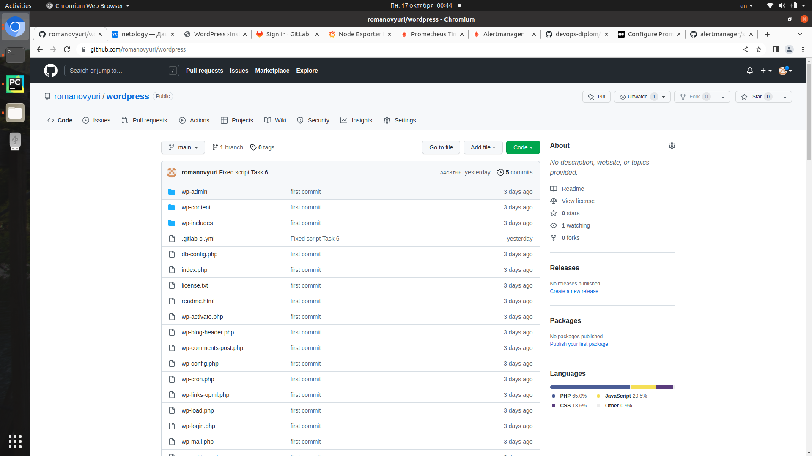

Создание сервера WordPress `app.devopsrom.ru` описано в [app.tf](./terraform/app.tf)

Настройка сервера WordPress `app.devopsrom.ru` в [app_install.tf](./terraform/app_install.tf)


*Ожидаемый результат достигнут.*

### 6. Установка Gitlab CE и Gitlab Runner

Необходимо настроить CI/CD систему для автоматического развертывания приложения при изменении кода.

#### Рекомендации:

• Имена серверов: `gitlab.devopsrom.ru` и `runner.devopsrom.ru`  

• Характеристики: 4vCPU, 4 RAM, Internal address.

#### Цель:

Построить pipeline доставки кода в среду эксплуатации, то есть настроить автоматический деплой на сервер app.eladmin.ru при коммите в репозиторий с WordPress.  

#### Ожидаемый результат:

Интерфейс Gitlab доступен по https.  

В вашей доменной зоне настроена A-запись на внешний адрес reverse proxy:

https://gitlab.devopsrom.ru (Gitlab)

На сервере `devopsrom.ru` отредактирован upstream для выше указанного URL и он смотрит на виртуальную машину на которой установлен Gitlab.  

При любом коммите в репозиторий с WordPress и создании тега (например, v1.0.0) происходит деплой на виртуальную машину.

---

#### Решение

Создание сервера GitLab CE `gitlab.devopsrom.ru` описано в [gitlab.tf](./terraform/gitlab.tf)

Создание сервера GitLab runner `runner.devopsrom.ru` описано в [runner.tf](./terraform/runner.tf)

Настройка сервера Gitlab CE и GitLab runner `runner.devopsrom.ru` в [gitlab_install.tf](./terraform/gitlab_install.tf)

GitLab требует дополнительной ручной настройки:

1. Создать проект `wordpress`

2. Импортировать проект с репозитория на github.

3. После импорта в проекте создать 3 переменные. Settings - CI/CD - Variables:

    - `ID_RSA` - Type File, Protected. 
    - `SERVER_IP` - Type Variable, Protected. 
    - `SERVER_USER` - Type Variable, Protected. 
   


4. Описать защищенные теги по маске `v*`. Settings - Repository - Protected tags. При создании тега будет происходить Deploy приложения на сервер.

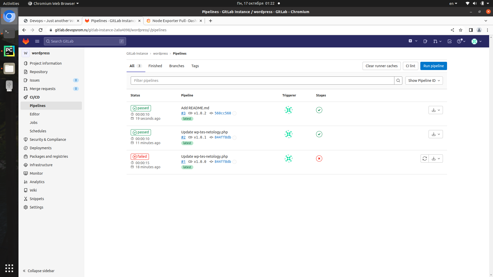

CI/CD pipeline заранее создан в репозитории приложения https://github.com/romanovyuri/wordpress/blob/main/.gitlab-ci.yml

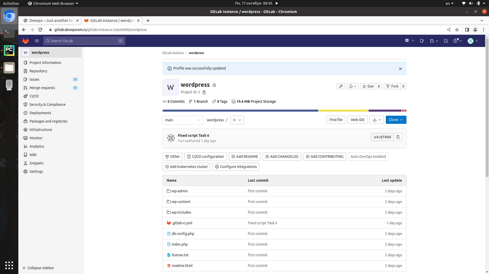

*Ожидаемый результат достигнут.*

---

### 7. Установка Prometheus, Alert Manager, Node Exporter и Grafana

Необходимо разработать Ansible роль для установки Prometheus, Alert Manager и Grafana.

#### Рекомендации:

• Имя сервера: `monitoring.devopsrom.ru`  

• Характеристики: 4vCPU, 4 RAM, Internal address.

#### Цель:

Получение метрик со всей инфраструктуры.

#### Ожидаемые результаты:

Интерфейсы Prometheus, Alert Manager и Grafana доступены по https.  

В вашей доменной зоне настроены A-записи на внешний адрес reverse proxy:

• https://grafana.devopsrom.ru (Grafana)

• https://prometheus.devopsrom.ru (Prometheus)

• https://alertmanager.devopsrom.ru (Alert Manager)

На сервере `devopsrom.ru` отредактированы upstreams для выше указанных URL и они смотрят на виртуальную машину на которой установлены Prometheus, Alert Manager и Grafana.  

На всех серверах установлен Node Exporter и его метрики доступны Prometheus.  

У Alert Manager есть необходимый набор правил для создания алертов.  

В Grafana есть дашборд отображающий метрики из Node Exporter по всем серверам.  

---
#### Решение

Создание сервера `monitoring.devopsrom.ru` описано в [monitoring.tf](./terraform/monitoring.tf)

Настройка сервера `monitoring.devopsrom.ru` в [monitoring_install.tf](./terraform/monitoring_install.tf)

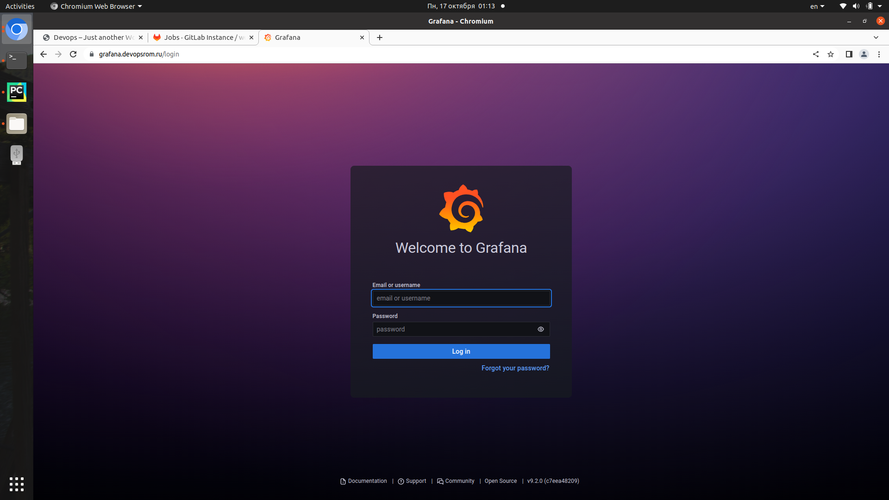

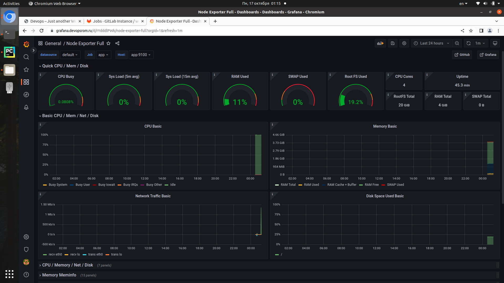


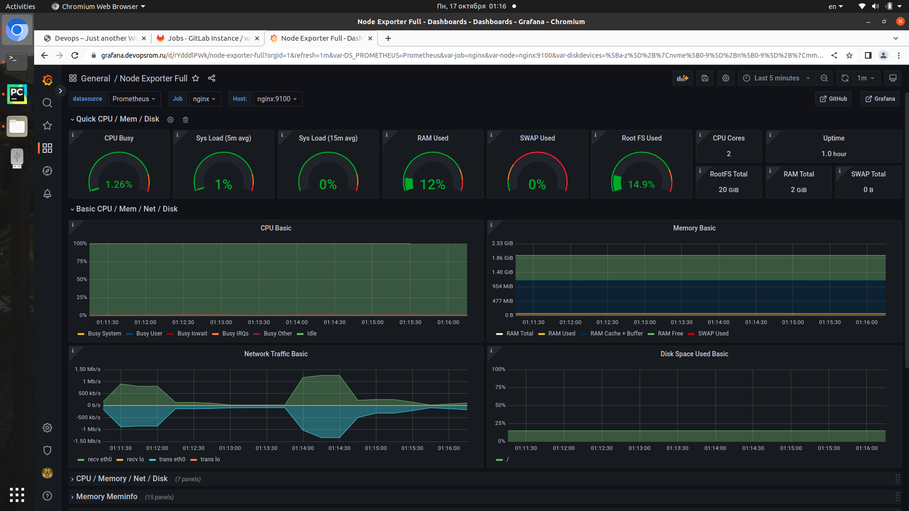

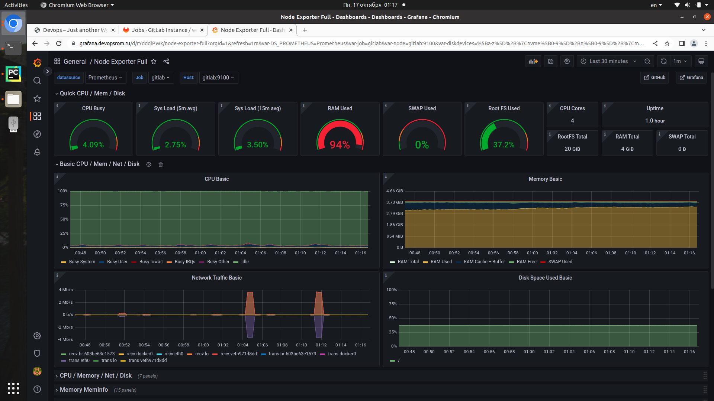

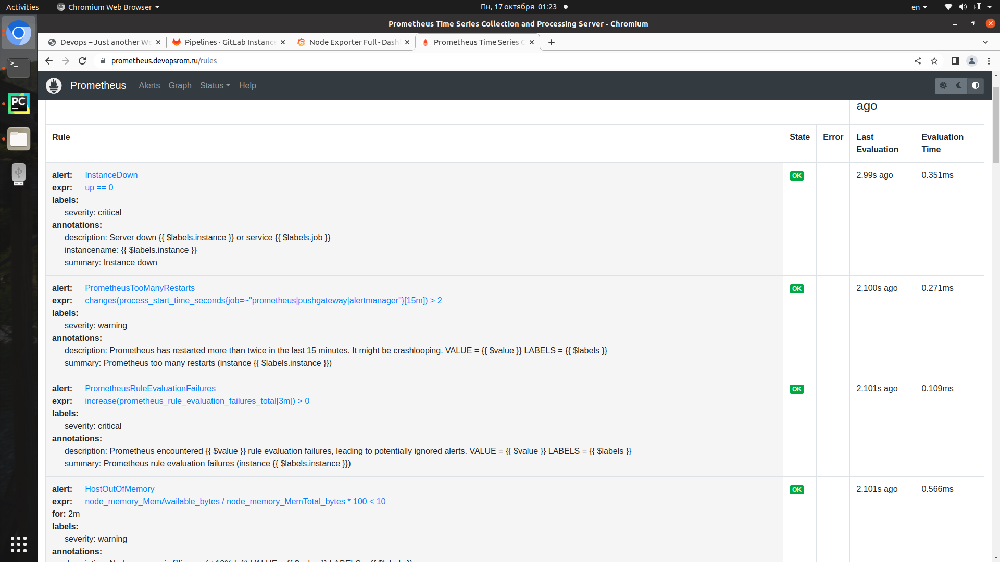

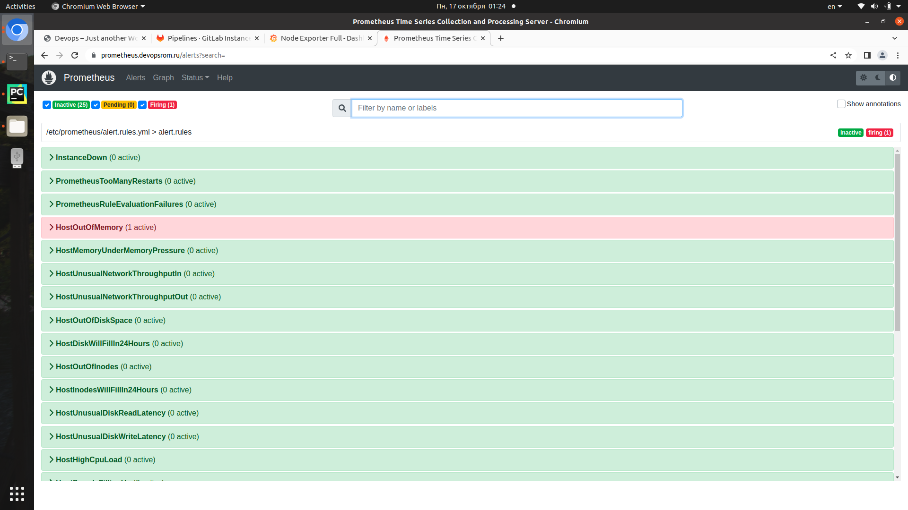

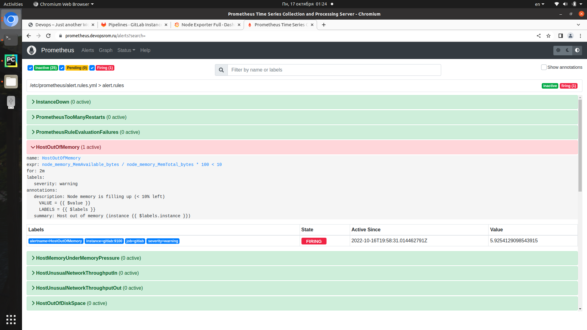

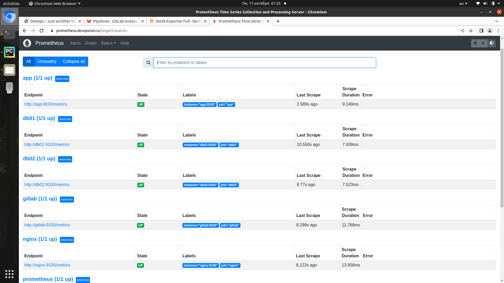

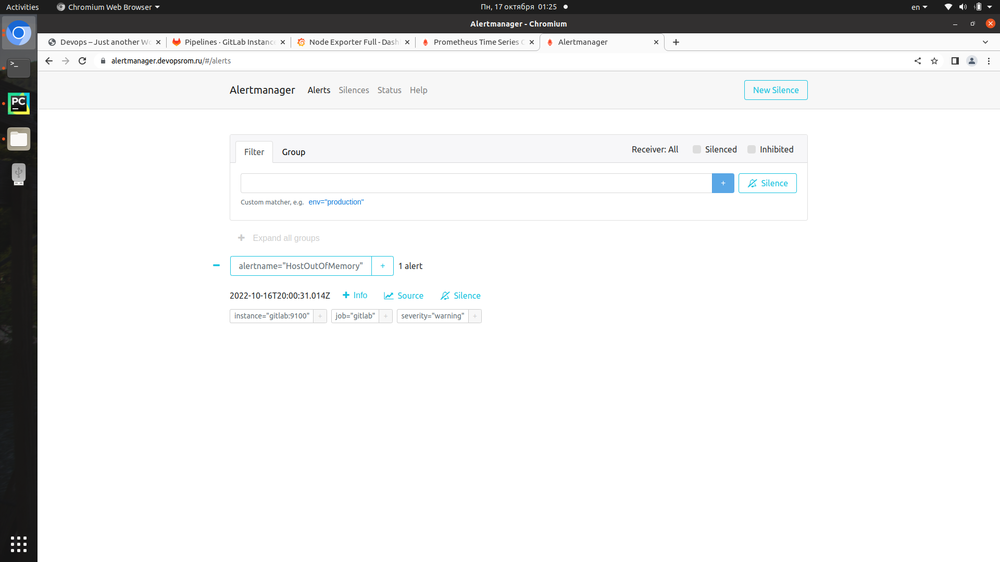

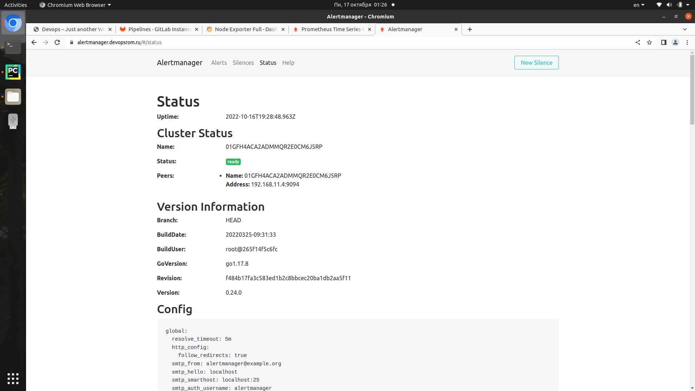

*Ожидаемый результат достигнут.*

Все screenshots находятся в репозитарии.
